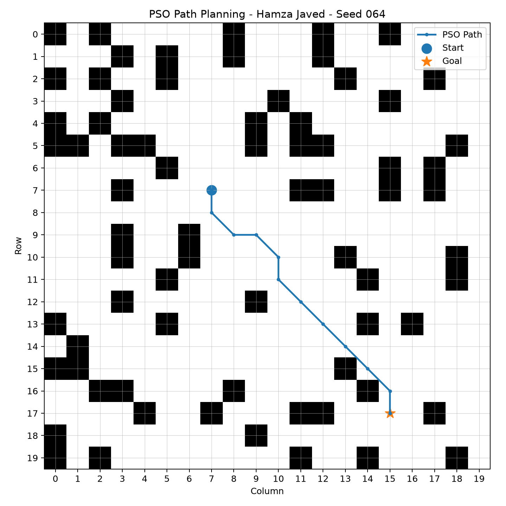
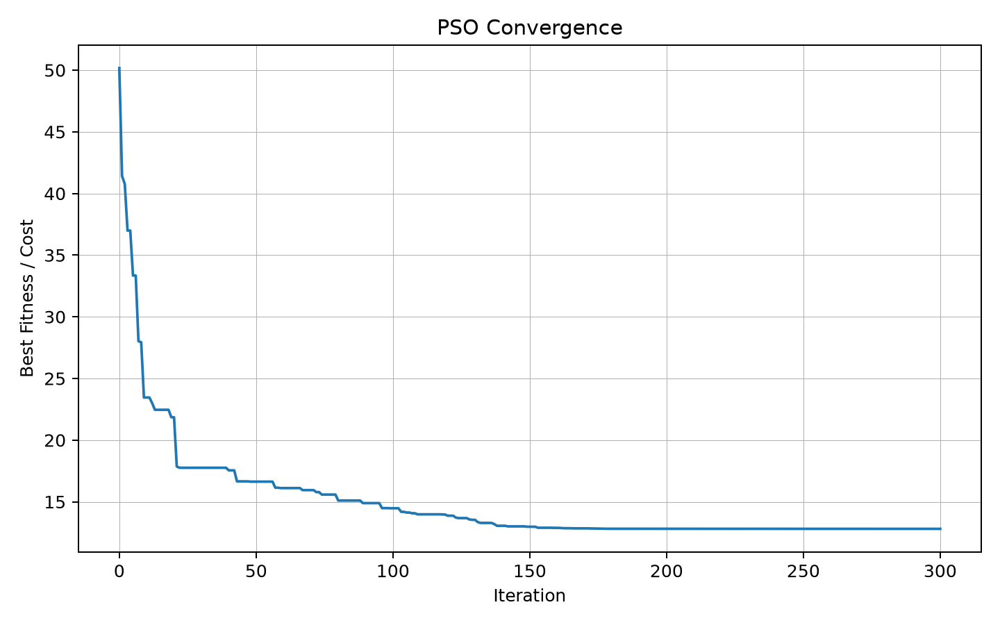

# Swarm-Based Path Planning with Obstacles

**Course:** Swarm Intelligence Lab  
**Assignment:** Assignment 1 — Swarm-Based Path Planning with Obstacles  
**Student:** Hamza Javed  
**Enrollment / Seed:** 064  
**GitHub Username:** hamza219676

This repository implements Particle Swarm Optimization (PSO) for finding a short, obstacle-free path from a randomly generated start point to a goal point on a 2D grid. The unique problem instance is generated programmatically using enrollment number **064** as the random seed.

## Repository Structure

- `pso_path_planning.py` — main PSO path-planning implementation
- `requirements.txt` — Python dependencies
- `results/` — generated plots and console output
- `flowchart.jpg` — hand-drawn flowchart photo

## How to Run

```bash
pip install -r requirements.txt
python pso_path_planning.py
```

## Approach

1. Enrollment number `064` is used as seed `64`.
2. The program generates a 20×20 grid with obstacles, start and goal programmatically.
3. Each PSO particle represents intermediate path waypoints.
4. Fitness rewards shorter paths and applies a large collision penalty for obstacle crossings.
5. PSO updates velocity, position, personal best (`pBest`) and global best (`gBest`).
6. The best solution is converted into grid cells and visualized.

## Parameters Used

| Parameter | Value |
|---|---:|
| Seed | 64 (Enrollment 064) |
| Grid | 20 × 20 |
| Obstacle ratio | 18% |
| Particles | 100 |
| Iterations | 300 |
| Intermediate waypoints | 8 |
| Cognitive coefficient (C1) | 1.7 |
| Social coefficient (C2) | 1.7 |
| Inertia | 0.9 → 0.4 |
| Collision penalty | 250 |

## Result for Seed 064

- **Start:** `(7, 7)`
- **Goal:** `(17, 15)`
- **Obstacles:** `72`
- **Collision count:** `0`

### Final Path Visualization



### PSO Convergence



### Hand-Drawn Flowchart


## Student Information

- **Name:** Hamza Javed
- **Enrollment:** 064
- **Seed:** 64
- **GitHub:** `hamza219676`
